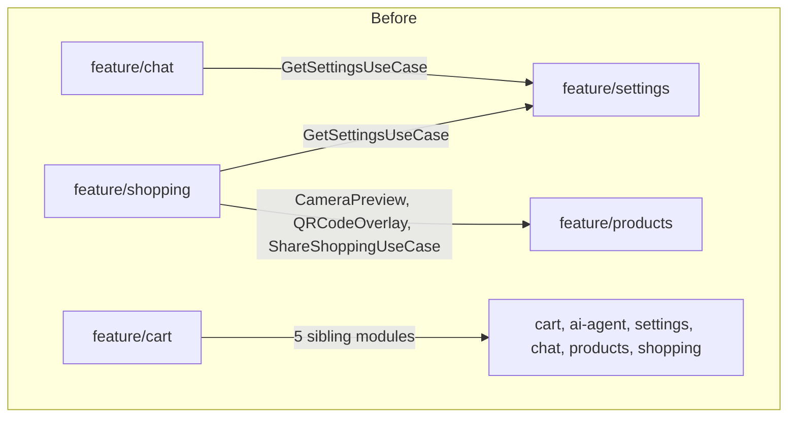
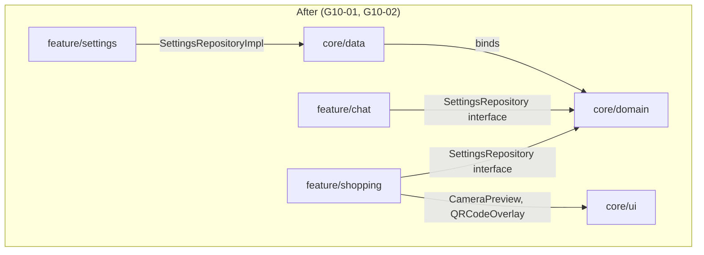
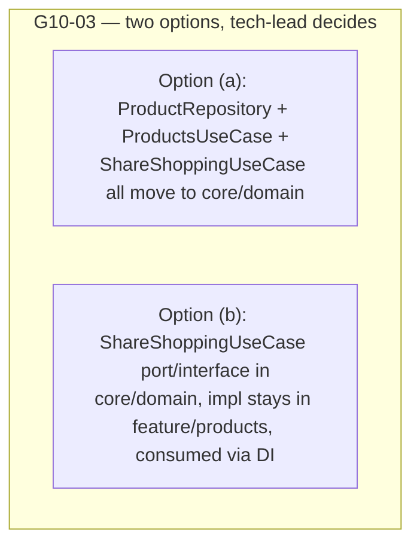

# Cross-Feature Module Coupling (G10) Design

**Spec**: `.specs/features/g10-cross-feature-decoupling/spec.md`
**Status**: G10-03 decided — see `AD-011` in `.specs/STATE.md` (2026-09-29). Chosen shape: a
segregated `ProductReader` contract in `core/domain`, `feature/products`'s `ProductRepository`
extends it, plus a separate `ShareShoppingUseCase` interface in `core/domain` (signature only, no
Android framework types) implemented in `feature/products`. All of G10-01..G10-05 are ready for
`tasks.md`.

---

## Architecture Overview

No new module, no new layer — this pass relocates existing contracts to the existing `core/*`
modules every other cross-cutting concern in this codebase already uses (`ShoppingRepository`,
`UserRepository`, `SubscriptionRepository` all live in `core/domain`/`core/data` today).

---

## Code Reuse Analysis

### Existing Components to Leverage

| Component | Location | How to Use |
| --------- | -------- | ---------- |
| `ShoppingRepository` interface/impl split | `core/domain`/`core/data` | Exact pattern to replicate for `SettingsRepository` (G10-01) — same module split, same Hilt binding shape. |
| `UserRepository`/`SubscriptionRepository` | `core/domain`/`core/data` | Second and third precedent confirming this is the established pattern, not a one-off. |
| `core/ui` module | `core/ui/build.gradle.kts` and its existing shared Composables | Destination for `CameraPreview`/`QRCodeOverlay` (G10-02) — every feature already depends on it for shared UI, no new dependency edge required. |
| `CameraPreviewExecutorLifecycleTest` | `feature/products/src/androidTest/.../scanner/` (G11 regression test) | Moves alongside the Composables it tests (G10-02) — do not leave it behind testing code that no longer lives in `feature/products`. |

### Integration Points

| System | Integration Method |
| ------ | ------------------- |
| Hilt DI | `SettingsModule`'s binding for `SettingsRepository` moves with the interface/impl split; `core/data`'s existing Hilt setup for `ShoppingRepositoryImpl` etc. is the template. |
| Gradle module graph | `feature/shopping/build.gradle.kts` and `feature/chat/build.gradle.kts` drop `implementation(project(":feature:settings"))` only after a re-grep confirms no remaining import (G10-01); `feature/products/build.gradle.kts` moves its CameraX dependencies to `core/ui/build.gradle.kts` (G10-02). |
| `:wear`'s aggregated Hilt component | G10-05 re-verifies `WearSubscriptionModule`'s stub against the post-shrink graph — no code change expected unless the stub is provably dead. |

---

## Components

### `SettingsRepository` (promoted)

- **Purpose**: Read/write app settings (the DataStore-backed contract currently trapped inside
  `feature/settings`).
- **Location**: interface → `core/domain/src/main/java/.../repository/SettingsRepository.kt`;
  impl → `core/data/src/main/java/.../repository/SettingsRepositoryImpl.kt`.
- **Interfaces**: unchanged signatures from today's `feature/settings/domain/repository/SettingsRepository.kt` — this is a relocation, not a redesign.
- **Dependencies**: DataStore (already a `core/data` dependency via other repositories).
- **Reuses**: `ShoppingRepository`'s interface/impl module split as the template; `SettingsModule`'s existing Hilt binding, moved and re-pointed.

### `CameraPreview` / `QRCodeOverlay` (promoted)

- **Purpose**: Generic camera-preview and QR-overlay Composables with no `products`-specific logic.
- **Location**: `core/ui/src/main/java/.../components/scanner/` (mirrors their current package
  shape under `feature/products/presentation/components/scanner/`).
- **Interfaces**: unchanged Composable signatures.
- **Dependencies**: CameraX (`androidx.camera.core/camera2/lifecycle/view`) — moves from
  `feature/products/build.gradle.kts` to `core/ui/build.gradle.kts`.
- **Reuses**: nothing new; this is a pure relocation plus its existing instrumented test.

### `ShareShoppingUseCase` boundary — **not designed here, see Tech Decisions**

Deliberately left undesigned pending `tech-lead`'s `AD-0xx`. Once decided, its component shape is
either "moved wholesale to `core/domain` alongside `ProductRepository`/`ProductsUseCase`" (Option a)
or "an interface in `core/domain`, one implementation in `feature/products`, consumed via
constructor injection from `feature/shopping`/`feature/cart`" (Option b) — see the Tech Decisions
table below for the full trade-off writeup. Detailing this component further before that decision
lands would be designing around a coin that hasn't been flipped.

### `feature/cart` dependency list (audit target, no new component)

- **Purpose**: N/A — this is a cleanup pass over `feature/cart/build.gradle.kts`, not a new
  component. Re-run `grep -rh "import br.com.brunocarvalhs.howmuch.feature\." feature/cart/src/main --include="*.kt" | sort -u` after G10-01–G10-03 land and drop any `implementation(project(":feature:x"))` line with no matching import.

### `WearSubscriptionModule` (verification target, no new component)

- **Purpose**: N/A — confirm whether the existing stub (`wear/src/main/java/.../di/WearSubscriptionModule.kt:13-21`) is still required once `:wear`'s transitively-pulled feature graph shrinks. No code change expected; if the stub becomes provably dead, remove it in its own small follow-up PR with the reasoning in that PR's commit message, not folded into this pass.

---

## Data Models (if applicable)

None — this pass moves existing interfaces/Composables between modules. No new or changed data
model. `ShoppingRepository`, `UserRepository`, `SubscriptionRepository`, and now `SettingsRepository`
all continue returning/accepting the same domain models they do today.

---

## Error Handling Strategy

| Error Scenario | Handling | User Impact |
| --------------- | -------- | ------------ |
| A feature module still imports something else from `feature/settings` after G10-01's grep | `build.gradle.kts`'s `implementation(project(":feature:settings"))` line is kept, not dropped | None — this is a build-graph correctness rule, not a runtime error path. |
| `CameraPreviewExecutorLifecycleTest` can't run (no instrumented device available) | Noted as unverified in the task/PR, not skipped or marked passing on faith | None — matches this project's existing convention for instrumented tests without a device (see `.specs/STATE.md` Maestro/F0.3 handling). |
| `tech-lead` hasn't recorded G10-03's `AD-0xx` yet | G10-03's implementation task stays `Blocked` in `tasks.md`; `android-engineer-architecture` does not start it | None — this is a process gate, not a runtime behavior. |
| `WearSubscriptionModule` stub turns out still required after the graph shrinks | Comment stays accurate; file is not deleted | None — G10-05's AC is "accurate comment," not "file deleted." |

---

## Risks & Concerns

| Concern | Location (file:line) | Impact | Mitigation |
| ------- | -------------------- | ------ | ---------- |
| `GetSettingsUseCase` deletion could silently break a caller not found by the initial grep | `feature/settings/domain/usecase/GetSettingsUseCase.kt` and its call sites in `app/MainViewModel`, `feature/shopping/ShoppingListViewModel`, `feature/chat/CartAssistantUseCase` | A missed call site fails to compile (safe — Kotlin catches it at build time) rather than a silent runtime gap | G10-01's acceptance criteria require the full module test suite (`:feature:settings:test :feature:shopping:test :feature:chat:test :app:test`) green after the move, which forces a compile-time catch of any missed site. |
| `CameraPreviewExecutorLifecycleTest` (G11 regression) is the only instrumented test this codebase runs on a device per `.specs/COVERAGE-BASELINE.md` — moving it risks losing device coverage if the move isn't followed through | `feature/products/src/androidTest/.../scanner/CameraPreviewExecutorLifecycleTest.kt` | If the test isn't moved and re-verified, G11's regression protection silently disappears | G10-02's acceptance criteria explicitly require the test to move alongside the Composables and pass from its new location; if no device is available, it must be flagged unverified, not silently dropped. |
| G10-03 picked as Option (a) turns into a much larger diff than the rest of this pass | N/A — future decision | Scope creep risk: `ProductRepository`'s promotion could cascade into other `feature/products` consumers not scoped by this design | Spec explicitly scopes G10-03's Option (a) to "break it into its own sub-tasks before starting" (per `G10-DESIGN-PASS.md`) rather than folding it into G10-04/G10-05's diff. |
| `feature/cart`'s dependency audit (G10-04) running before G10-03 lands could remove a dependency still needed for `ShareShoppingUseCase`'s current (pre-decision) import shape | `feature/cart/build.gradle.kts` | Premature removal breaks the build | `tasks.md` sequences G10-04 after G10-01, G10-02, **and** G10-03 (not just G10-01/G10-02) — matches `G10-DESIGN-PASS.md`'s own "Dependencies: T1, T2, T3 (run last)" note for this task. |

> All flagged concerns have a mitigation above — none are unaddressed.

---

## Tech Decisions (only non-obvious ones)

| Decision | Choice | Rationale |
| -------- | ------ | --------- |
| Where shared repository interfaces live | `core/domain` (interface) / `core/data` (impl) | Matches the existing, already-established pattern for `ShoppingRepository`/`UserRepository`/`SubscriptionRepository`. Not inventing a new shape for `SettingsRepository`. |
| Where shared scanner UI lives | `core/ui` | Every feature module already depends on `core/ui`; no new Gradle edge needed. |
| **G10-03: `ShareShoppingUseCase`'s module boundary** | **Decided — `AD-011` (`.specs/STATE.md`, 2026-09-29): segregated `ProductReader` contract in `core/domain` (`feature/products`'s `ProductRepository` extends it) + a separate `ShareShoppingUseCase` interface in `core/domain`, implemented in `feature/products`** | Neither Option (a) nor Option (b) alone: (a) over-promotes the full CRUD surface for a read-only need (ISP violation); (b) alone leaves no reusable contract for a future read-only consumer (would need a 4th one-off port later). The segregated-contract synthesis satisfies ISP (clients depend only on `getAllProducts`), keeps OCP (writes added to `ProductRepository` don't ripple to `ProductReader` consumers), holds LSP (`ProductRepository` is a pure superset of `ProductReader`), and follows YAGNI (no full-repository promotion until a second consumer actually needs writes). Full reasoning in `AD-011`. |
| No new Gradle module | Reuse `core/domain`/`core/data`/`core/ui` for both G10-01 and G10-02 | `G10-DESIGN-PASS.md`'s Decision section explicitly rejects `core/scanner`/`core/settings-api` as over-engineering for a 2-consumer fan-out. Both options for G10-03 also stay within existing modules. |

> **Project-level decision surfaced here**: "shared repository interfaces promoted to `core/domain`
> with the implementation in `core/data`" is already the established pattern (three prior
> precedents), not a new one — no new `AD-NNN` needed for G10-01/G10-02, this design simply applies
> the existing pattern. G10-03 is the one item that produces a genuinely new `AD-0xx`, and it is
> `tech-lead`'s to write once decided, not pre-written here.
