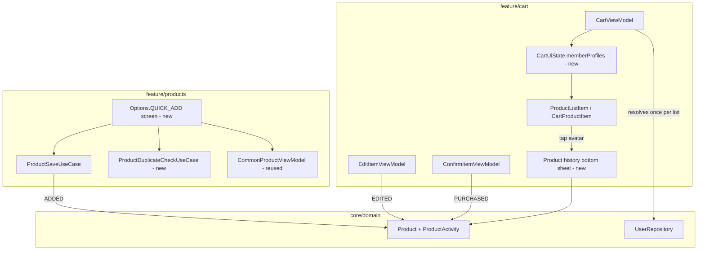

# Item Add Flow & Authorship Design

**Spec**: `.specs/features/item-add-authorship/spec.md`
**Status**: Ready for Tasks
**Inputs**: persona review, UX/accessibility review, PM↔Tech Lead reconciliation
(`.specs/PERSONA-ACTION-PLAN.md`) — all dated 2026-09-04.

---

## Architecture Overview

No new module and no new architectural layer. This feature extends the existing `Product` domain
model and touches `feature/cart` (rendering, history sheet) and `feature/products` (the add
surfaces), reusing `core/domain`'s `UserRepository`/`AuthService` exactly as `feature/shopping`
already does for list members.



---

## Domain Layer Design

### `ProductActivity` (new)

```kotlin
// core/domain/src/main/java/.../model/ProductActivity.kt
@Serializable
data class ProductActivity(
    val userId: String,
    val action: Action,
    val timestamp: Long = System.currentTimeMillis()
) {
    @Serializable
    enum class Action { ADDED, EDITED, PURCHASED }
}
```

### `Product` (extended)

```kotlin
@Serializable
data class Product(
    val id: String,
    val name: String,
    val quantity: Double,
    val price: Double? = null,
    val isPurchased: Boolean = false,
    val category: String = "Outros",
    val barcode: String? = null,
    val history: List<ProductActivity> = emptyList()   // new
) {
    val total: Double get() = price.orEmpty() * quantity

    // New — same member-computed-property style as `total` (Tech Lead: keep the
    // pattern the domain model already committed to, don't introduce extension
    // functions for a stylistically identical concept).
    val addedBy: String? get() = history.firstOrNull { it.action == ProductActivity.Action.ADDED }?.userId
    val lastEditedBy: String? get() = history.lastOrNull { it.action == ProductActivity.Action.EDITED }?.userId
    val purchasedBy: String? get() = history.lastOrNull { it.action == ProductActivity.Action.PURCHASED }?.userId
    val lastActivity: ProductActivity? get() = history.maxByOrNull { it.timestamp }
}
```

### Single construction point (Tech Lead addendum — avoid 3-way DRY drift)

`ProductSaveUseCase`, `EditItemViewModel.onSaveEdit`, and `ConfirmItemViewModel.onConfirmPurchased`
all need to append one `ProductActivity`. Instead of each building the entry inline, add one domain
function next to `Product`:

```kotlin
// core/domain/src/main/java/.../model/Product.kt (or a small extensions file alongside it)
fun Product.withActivity(action: ProductActivity.Action, userId: String): Product =
    copy(history = history + ProductActivity(userId = userId, action = action))
```

All three call sites use `product.withActivity(ADDED, userId)` / `.withActivity(EDITED, userId)` /
`.withActivity(PURCHASED, userId)` before persisting. This is the only place that constructs a
`ProductActivity`.

### `ProductDuplicateCheckUseCase` (new, P2)

```kotlin
class ProductDuplicateCheckUseCase @Inject constructor(
    private val repository: ProductRepository
) {
    suspend operator fun invoke(name: String, shoppingId: String): Product? =
        repository.getAllProducts(shoppingId).first()
            .firstOrNull { !it.isPurchased && it.name.trim().equals(name.trim(), ignoreCase = true) }
}
```

Called by the Quick Add save action and by `ProductSaveUseCase`'s AI path before the item is
persisted; returns the existing `Product` (so the caller can read `.addedBy` for the warning
message) or `null`.

---

## Presentation Layer Design

### Resolving avatars once per list (Tech Lead performance addendum)

`CartUiState` gains one field:

```kotlin
val memberProfiles: Map<String, UserProfile> = emptyMap()
```

`CartViewModel` computes it once when `shopping`/`products` load — collect the distinct `userId`s
present across `shopping.users` and every `Product.history` entry in the current list, resolve each
via `UserRepository.getUserProfile(id)`, and cache the result in `CartUiState`. `ProductListItem`
and `CartProductItem` only do a map lookup (`uiState.memberProfiles[product.lastActivity?.userId]`)
— **no per-row repository call**, no per-row `Flow` subscription. The history bottom sheet reuses
the same map for every entry it lists.

### Product row (`ProductListItem`, `CartProductItem`)

- Show the avatar for `product.lastActivity`'s `userId`, resolved via `memberProfiles`, reusing the
  existing `UserAvatars` visual shell (`ShoppingItem.kt:206-227`) — that component currently only
  draws a generic person icon per user; it needs the profile-photo/initials rendering added, since
  today it doesn't resolve real names/photos.
- Hidden entirely when `shopping.users.size <= 1` (spec IAA-01 AC6).
- Tapping the avatar opens the history bottom sheet (see Navigation below).
- Fallback: `UserProfile.name == null` → generic person icon, never blank space (AC7).

### Product history bottom sheet (new)

A simple list, newest-last (chronological), one row per `ProductActivity`: `"<action label> por
<nome ou ícone genérico> · <hora formatada>"`. No new screen — a `ModalBottomSheet`, same pattern
as `ConfirmItemRoute`/`EditItemRoute` in `CartGraph.kt`.

### `Options.QUICK_ADD` (new default surface, P3)

New entry in `Options` enum, becomes `ProductScreen`'s `startDestination` (replacing `Options.AI`).
Composed of, on one screen:

- A text field (same input pattern as `ProductSearchForm`'s field) that saves via
  `ProductSaveUseCase` on submit, running `ProductDuplicateCheckUseCase` first.
- Common-product chips sourced from the **existing** `CommonProductViewModel` /
  `CommonProductIntent.onAddToShopping` — this *is* the "Common" toggle that lives inside
  `SuggestionsAndCommonForm.kt` today, relocated here as the default, not duplicated. Once moved,
  `SuggestionsAndCommonForm`'s Common toggle is removed (its data source, not its logic, moves).
- A scan/photo affordance that navigates to the existing `Options.PHOTO` destination — no new
  scanning logic, just an entry point into what already exists.
- A persistent mini header showing the running total/budget: a small `QuickAddViewModel` observes
  `ProductsUseCase(shopping.id)` (same pattern `ShoppingDuplicateUseCase` already uses to collect a
  list's products) and sums `.total`, compared against `shopping.budget` — same computation
  `CartBottomBar`/`SummaryCard` already do, just re-hosted here since `ProductScreen` is a separate
  `ModalBottomSheet` from `CartScreen` and can't read `CartViewModel`'s state directly (`AD-005`:
  feature internals stay internal — no cross-ViewModel reach-across).

`ProductHeader`'s existing option selector keeps AI / Search / Photo / Suggestions reachable exactly
as today; only the default start destination and the Suggestions-tab content change.

---

## Data Layer Design

- `ProductModel` (`feature/products/data/model/ProductModel.kt`) gains a `history` field
  serialized as a list of maps (`{"userId": ..., "action": "ADDED", "timestamp": ...}`), mirroring
  how the rest of the model already round-trips to Firestore via `toMap()`/`fromMap()`.
- `ProductMapper` extended both directions; missing/null `history` on read maps to `emptyList()`
  (pre-existing products have none — spec Edge Cases, no backfill).
- No schema migration needed — Firestore is schemaless; old documents simply lack the field until
  next write.

---

## Code Reuse Analysis

| Component | Location | How it's used |
| --------- | -------- | -------------- |
| `UserAvatars` | `feature/shopping/.../ShoppingItem.kt:206-227` | Visual shell reused for row-level attribution avatar; needs real profile resolution added (today: generic icon only). |
| `ModalBottomSheet` pattern | `CartGraph.kt` (`ConfirmItemRoute`, `EditItemRoute`) | Reused for the new product-history sheet — same dialog-route shape, no new navigation primitive. |
| `CommonProductViewModel` + `CommonProductIntent` | `feature/products/presentation/viewmodel/`, `.../intent/CommonProductIntent.kt` | Reused as-is for Quick Add's chips (`onAddToShopping`); no new use case needed. |
| `ProductsUseCase(shoppingId)` collection pattern | `ShoppingDuplicateUseCase.kt` | Same `Flow` observation pattern reused by the new `QuickAddViewModel` to compute the mini total. |
| `UserRepository.getUserProfile(id)` | `core/domain/repository/UserRepository.kt` | Reused, called once per distinct member per list load (not per row). |
| `Product.total` computed-property style | `core/domain/model/Product.kt` | Precedent followed for `addedBy`/`lastEditedBy`/`purchasedBy`/`lastActivity`. |

---

## Error Handling Strategy

| Error Scenario | Handling | User Impact |
| --------------- | -------- | ------------ |
| `UserRepository.getUserProfile(id)` fails/times out for a member | Cache miss falls back to generic person icon for that user, doesn't block list rendering | Avatar shows generic icon instead of name/photo; no crash, no blocked list |
| Duplicate-check read fails (network) | Fail open — skip the warning, allow the add | Worst case: no warning shown once; never blocks adding an item (matches P2 AC2's "no hard block" intent) |
| Two users add the same name in the same instant (race) | Both saved, accepted trade-off per spec Edge Cases | Warning simply doesn't catch the second one — documented, not a bug |
| `history` missing on a legacy product | Mapper defaults to `emptyList()` | Row renders with no attribution avatar, exactly like a single-member list |

---

## Tech Decisions (only non-obvious ones)

| Decision | Choice | Rationale |
| -------- | ------ | --------- |
| Profile resolution point | Once per list, in `CartViewModel`, cached in `CartUiState.memberProfiles` | Avoids N per-row repository calls/`Flow` subscriptions (Tech Lead performance finding) |
| `addedBy`/`lastEditedBy`/`purchasedBy` | Member computed properties on `Product`, not extension functions | Matches the existing `total` precedent in the same class — consistency over a stylistic alternative |
| History entry construction | One shared `Product.withActivity(...)` function, called from all three write sites | Prevents the three call sites (save/edit/confirm) from drifting on how an entry is built |
| Quick Add's common-product chips | Relocate `CommonProductViewModel` usage from `SuggestionsAndCommonForm`'s Common toggle into `Options.QUICK_ADD`, don't duplicate | Two paths to the same common-product list is exactly the confusion this spec exists to remove |
| Quick Add's total header | New lightweight `QuickAddViewModel` reading `ProductsUseCase(shopping.id)` directly, not a reach into `CartViewModel` | Respects `AD-005` module-internal boundaries; `ProductScreen` is a separate `ModalBottomSheet`/ViewModel scope from `CartScreen` |

---

## Risks & Concerns

| Concern | Location | Impact | Mitigation |
| ------- | -------- | ------ | ---------- |
| `history` grows unbounded on heavily-edited items | `Product.history` | Larger Firestore documents over many edits | Accepted for v1 per spec (typical edit count per item is small); revisit only if data shows otherwise |
| `UserAvatars` today only draws a generic icon, not real photo/initials | `ShoppingItem.kt:206-227` | Reusing it as-is would silently ship without real attribution | Must extend it to accept a resolved `UserProfile` (name/photo), not just count of users, as part of this feature — flagged here so it's not missed in Tasks |
| Removing the Common toggle from `SuggestionsAndCommonForm` changes an existing screen | `SuggestionsAndCommonForm.kt:57-68` | Existing tests/snapshots for that composable likely need updating | Treat as an explicit task, not a side effect — update/remove affected tests in the same change |
| `QuickAddViewModel`'s total may lag `CartViewModel`'s by one write (different Flow instances) | New `QuickAddViewModel` | Cosmetic: total could be briefly stale right after another member's edit | Acceptable — both observe the same Firestore source, converge within normal sync latency, same as any two independent `Flow` collectors in this app today |
