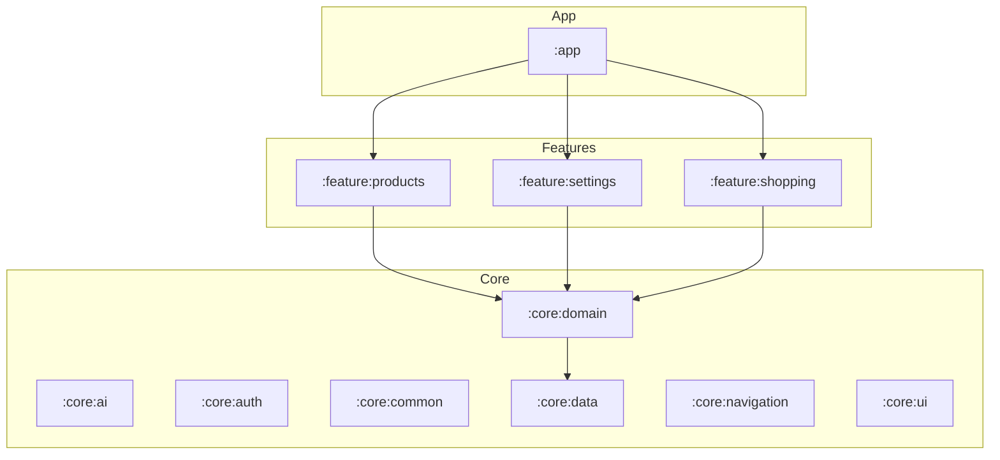

# SDD Infrastructure & Project Mapping Design

**Spec**: `.specs/features/sdd-initialization/spec.md`
**Status**: Approved

---

## Architecture Overview

The "How Much" project follows a Clean Architecture approach with a multi-module structure. The documentation will reflect this organization.

---

## Documentation Structure

### 1. Project Memory (`STATE.md`)
- **Decisions:** Document the core architectural choices (Clean Arch, Compose, Hilt, MVI with Intents, Navigation 3).
- **Handoff:** Current state of the SDD initialization feature.

### 2. Feature Specifications (`.specs/features/`)
Each core feature will have a `spec.md` mapping its current functionality using EARS notation. Features follow the structure:
- `domain/`: Business logic (Entities, UseCases).
- `data/`: Data persistence and network (Repositories, Mappers).
- `presentation/`: UI state management (MVI State/Intent, Screens, ViewModels).
- `navigation/`: Feature routes and graph definitions (Navigation 3).
- `di/`: Hilt modules.

| Feature | Scope | Key Use Cases |
| ------- | ----- | ------------- |
| Shopping | Core | Create, observe, join, share, budget |
| Products | Core | Scan, search, suggestions, AI analysis, recipe add |
| Settings | Core | AI config, theme, data management, notifications |
| AI | Core | Assistant, message processing |

### 3. Changelog & READMEs
- **CHANGELOG.md:** Aggregate git log entries since 2025-10-21 into semantic versioned entries.
- **README.md:** Update to reflect current architecture and CI/CD status if needed.

---

## Code Reuse Analysis

### Existing Components to Leverage

| Component | Location | How to Use |
| --------- | -------- | ---------- |
| README.md | `/` | Base for architectural description. |
| Entity Classes | `core:domain/src/main/java/.../entity/` | Source for domain models in specs. |
| UseCase Classes | `feature:*/src/main/java/.../domain/usecase/` | Source for Acceptance Criteria in specs. |

---

## Error Handling Strategy (for Documentation)

| Error Scenario | Handling | User Impact |
| -------------- | -------- | ----------- |
| Missing source code | Document as "Undocumented" or "TBD" in spec. | Awareness of coverage gaps. |
| Inconsistent patterns | Flag in `STATE.md` or as Risks in `design.md`. | Highlighted technical debt. |

---

## Tech Decisions (only non-obvious ones)

| Decision | Choice | Rationale |
| -------- | ------ | --------- |
| Changelog Format | Semantic Versioning style | Follows project's existing pattern. |
| Spec Depth | Medium (ACs only for key logic) | Balance between speed and thoroughness for legacy code. |

---

## Risks & Concerns

| Concern | Location (file:line) | Impact | Mitigation |
| ------- | -------------------- | ------ | ---------- |
| Outdated README | `/README.md` | Misleading info for new devs. | Verify architecture against current module structure. |
| Missing Tests | Various use cases | Lower verification confidence. | Document missing tests in the reverse-engineered specs. |
| Jakarta.inject migration | `7c6c312` (commit) | Potential DI inconsistencies. | Document in `STATE.md` if it's a project-wide convention. |

---
